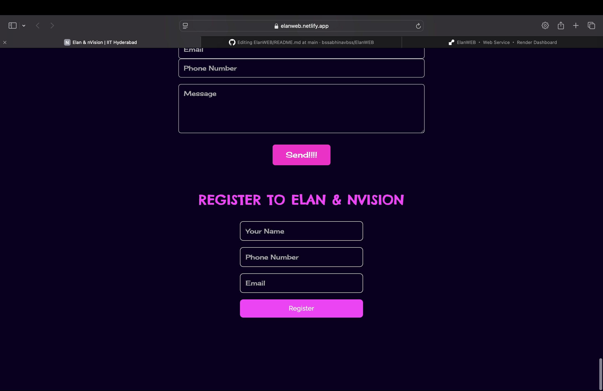
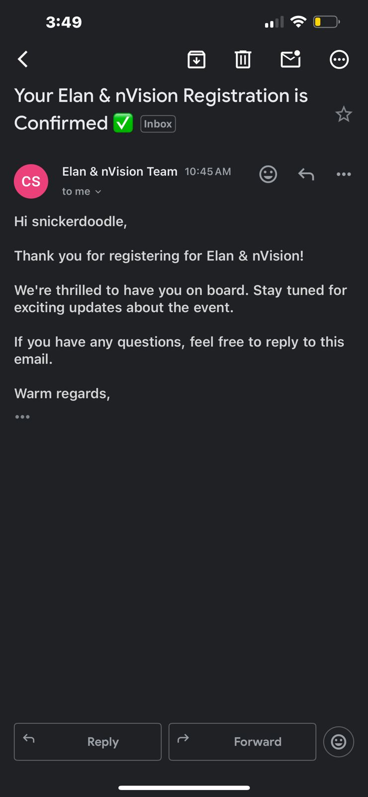

# Elan & nVision | IIT Hyderabad Website

A responsive and modern event homepage built for Elan & nVision, the techno-cultural fest of IIT Hyderabad. This project includes both a front-end in React and a back-end built with Express and MongoDB to handle user registrations.

## 1. Technologies Used

### Frontend:
- React.js (with Vite)
- HTML5 & CSS3
- React Router DOM
- React Icons
- Google Fonts: Chelsea Market, Cherry Cream Soda, Raleway

### Backend:
- Node.js
- Express.js
- MongoDB Atlas
- Nodemailer (Gmail SMTP)

---

## 2. File Structure
- ├── Backend
- │   ├── controllers
- │   ├── models
- │   ├── node_modules
- │   ├── package-lock.json
- │   ├── package.json
- │   ├── routes
- │   └── server.js
- ├── Frontend
- │   ├── README.md
- │   ├── dist
- │   ├── eslint.config.js
- │   ├── index.html
- │   ├── node_modules
- │   ├── package-lock.json
- │   ├── package.json
- │   ├── public
- │   ├── src
- │   └── vite.config.js
- ├── README.md
- ├── node_modules
- ├── package-lock.json
- ├── package.json
---

## 3. Deployment

### Frontend:
- link:https://elanweb.netlify.app
- Built using `npm run build` from Vite
- Deployed manually on Netlify by uploading the `dist/` folder

### Backend:
- link:https://elanweb.onrender.com
- Can be deployed to services like Render
- Connected to MongoDB Atlas for cloud database
- Environment variables stored in `.env`
- .env file contents:
## MONGO_URI=your_mongodb_uri
## EMAIL_USER=your_email@gmail.com
## EMAIL_PASS=your_app_password

---

## 4. Preview Screenshots

### Homepage:

### Register Form:

### Working of registration

---

## 5. Improvements

- Add user authentication with OTP or email verification
- Add backend input sanitization and validation using libraries like Joi or express-validator
- Store registration data in a more structured collection (add timestamps, etc.)
- Animations and designs to be improved alot 
- Enable dark/light mode toggle on frontend
- Add events and guest pages with dynamic content from a CMS or database
